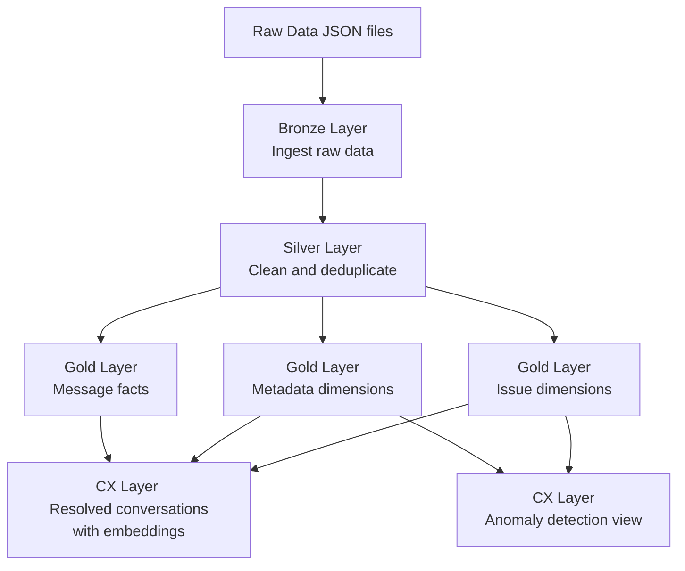

# conversation-analysis
Parses raw conversation data and intelligently provides context regarding anomalies.

## Overview
This project ingests customer conversation data, processes it through a dbt pipeline in DuckDB, and generates insights like resolved issues and anomaly detection.

## Prerequisites
- Python 3.12
- DuckDB (for local querying)

## Installation
1. Create and activate a Python virtual environment:
   ```
   python3.12 -m venv .venv
   source .venv/bin/activate
   ```

2. Install dependencies:
   ```
   python3.12 -m pip install -r requirements.txt
   ```

## Usage
1. Run the orchestration script:
   ```
   chmod +x src/orchestrator.sh
   ./src/orchestrator.sh
   ```

2. Test the dbt pipeline:
   ```
   dbt test --target {environment}
   ```

3. Query data locally with DuckDB UI:
   ```
   curl https://install.duckdb.org | sh
   duckdb ui
   ```

## Data Pipeline
The dbt pipeline transforms raw data into structured layers for analysis. Below is a simplified dataflow diagram:

